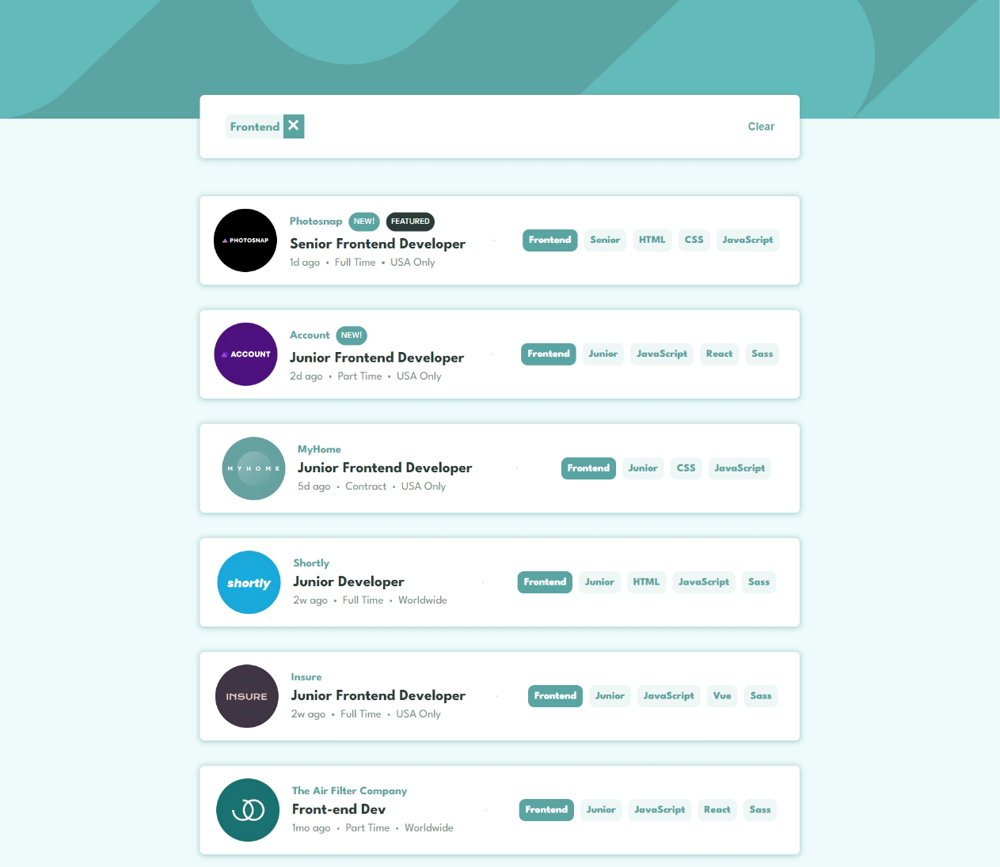
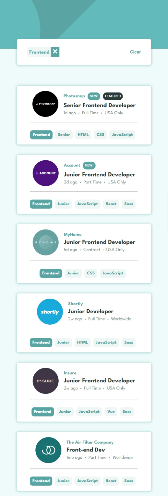

# Frontend Mentor - Job listings with filtering solution

This is a solution to the [Job listings with filtering challenge on Frontend Mentor](https://www.frontendmentor.io/challenges/job-listings-with-filtering-ivstIPCt). Frontend Mentor challenges help you improve your coding skills by building realistic projects.

## Table of contents

- [Overview](#overview)
  - [The challenge](#the-challenge)
  - [Screenshot](#screenshot)
  - [Links](#links)
- [My process](#my-process)
  - [Built with](#built-with)
  - [What I learned](#what-i-learned)
  - [Continued development](#continued-development)
  - [Useful resources](#useful-resources)
- [Author](#author)
- [Acknowledgments](#acknowledgments)

## Overview

### The challenge

Users should be able to:

- View the optimal layout for the site depending on their device's screen size
- See hover states for all interactive elements on the page
- Filter job listings based on the categories

### Screenshot

### Links

- Solution URL: [https://www.frontendmentor.io/solutions/responsive-job-listing-using-html-css-js-yyPzKz4NIp](https://www.frontendmentor.io/solutions/responsive-job-listing-using-html-css-js-yyPzKz4NIp)
- Live Site URL: [https://joblistingfrontend.netlify.app/](https://joblistingfrontend.netlify.app/)

## My process

### Built with

- Semantic HTML5 markup
- CSS custom properties
- Flexbox
- Mobile-first workflow
- Array Methods

### What I learned

I learned to make responsive website with the help of flex property. It make easier for us to make website responsive easily. And also I learned that without filter also we can add function for filtering job which was hard part of this challenge. I learned to search for problems and solve it and it improves my problem solving skill which is best. And I learned not to give up if we stuck we can overcome it event if it take many days weeks or months.

### Continued development

I will continue to focus on improving writing javascript code clean effecient and more maintainable. I will continue learning problem solving skill and make more and more project. It was challenging for adding filter logic in which i was stuck the most i will keep improving in this areas and make websites more interactive.
Use this section to outline areas that you want to continue focusing on in future projects. Also I will improve in my project planning which is the area i need to improve most.

### Useful resources

- [Chat GPT](https://chatgpt.com/) - This helped me for debuging my code and making my cofusion clear . I really liked this pattern and will use it going forward.
- [Google, Stackoverflow](https://www.google.com/) - This helped me for finding usefull methods and getting confidence my ideas.

## Author

- Website - [Sudip khatri](https://sudipkhatri.netlify.app/)
- Frontend Mentor - [@SudipKhatri036](https://www.frontendmentor.io/profile/SudipKhatri036)
- Linkedin - [@SudipKhatri](https://www.linkedin.com/in/sudip-khatri-a72a6a27b/)

## Acknowledgments

I will like to thanks @Damola-147 which github repository helped me a lot for finding some help which helped me to understand more things and it helped me to understand more about logics building and structuring
-GitHub - [@Damola-147](https://github.com/Damola-147/Static-Job-Listing)
